# EvoCharge System Design

## Architecture Flowchart

```mermaid
flowchart LR

  %% =========================
  %% Data Sources
  %% =========================
  A1[Kaggle API\nEV Charging Sessions\n3,500 records]
  A2[Kaggle API\nEV Charging Stations US\n65K+ stations Feb 2024\n54K+ stations Jan 2023]
  A3[AFDC Data\nAlternative Fuels\nData Center\nTop 50 stations]
  A4[Industry Research\nPricing Models\nCharger Specifications]

  %% =========================
  %% ETL + Raw Data
  %% =========================
  B0[(EvoCharge ETL Pipeline)]
  B1[kagglehub.dataset_download\nfetch sessions data\nauto-caching]
  B2[kagglehub.dataset_download\nfetch stations data\nExcel to DataFrame]
  B3[manual collection\nAFDC scraping\nCSV export]
  B4[pricing_rules.py\ndefine cost models\nmodifier logic]

  %% =========================
  %% Storage - Raw Data
  %% =========================
  C1[(ev_charging_sessions/\nev_charging_sessions.csv)]
  C2[(ev_charging_stations/\nfeb2024_cleaned.csv\njan2023_cleaned.csv\nfeb2024_public.csv)]
  C3[(afdc/\nafdc_stations_raw.csv\nafdc_stations_top50.csv)]

  %% =========================
  %% Data Cleaning
  %% =========================
  D0[Data Cleaning Layer]
  D1[charging_sessions.ipynb\nload + validate\nno missing values]
  D2[ev_charging_stations.ipynb\nfill NaN with 0\ncreate derived features]
  D3[data.ipynb\nAFDC processing\ngeographic filtering]

  %% =========================
  %% Feature Engineering
  %% =========================
  E0[Feature Engineering]
  E1[Temporal Features\nhour of day\nday of week\nweekday vs weekend]
  E2[Station Features\nTotal_Chargers\nHas_Level1/2/DC_Fast\ncharger type flags]
  E3[User Patterns\navg consumption per user\ncharging frequency\nstation preferences]
  E4[Session Features\nenergy per minute\nsession efficiency\ntype encoding]
  E5[(features_engineered.csv\nmodel-ready dataset)]

  %% =========================
  %% Modeling Pipeline
  %% =========================
  F0[ML Model Development]
  F1[energy_prediction_model.ipynb\ntrain/test split\ntemporal validation]
  F2[Models\nRandom Forest Regressor\nGradient Boosting\nXGBoost]
  F3[Hyperparameter Tuning\nGridSearchCV\nRandomizedSearchCV]
  F4[Model Evaluation\nRMSE / MAE / R²\nfeature importance]
  F5[(models/\nenergy_predictor.pkl\nscaler.pkl\nfeature_names.pkl)]

  %% =========================
  %% Pricing Engine
  %% =========================
  G0[Cost Estimation Engine]
  G1[Base Pricing\nDC Fast: $0.40-0.60/kWh\nLevel 2: $0.20-0.30/kWh\nLevel 1: $0.10-0.15/kWh]
  G2[Pricing Modifiers\nnetwork premium\naccess type\nlocation factor\nfacility type\ntime of day]
  G3[Cost Calculator\nPredicted kWh × Base × Modifiers]
  G4[(pricing_model.py\ncost estimation logic)]

  %% =========================
  %% Analytics Engine
  %% =========================
  H0((EvoCharge Analytics Engine))
  H1[Prediction Service\nenergy consumption forecast\nconfidence intervals]
  H2[Cost Estimator\nreal-time pricing\nscenario comparison]
  H3[Station Analyzer\nfilter by location\ncharger availability\nnetwork distribution]
  H4[Recommendation Engine\noptimal charging times\ncost-saving suggestions\nstation alternatives]

  %% =========================
  %% Streamlit Dashboard
  %% =========================
  I0[Streamlit Dashboard\nstreamlit_app.py]
  I1[Location Selector\ninteractive map\nstation density heatmap\ncity/state search]
  I2[Station Browser\nfilter by charger type\nnetwork provider\naccess type\nfacility type]
  I3[Session Configurator\nduration slider\ntime picker\nsession type selector\ncharger type choice]
  I4[Prediction Display\nenergy consumption card\ncost estimation card\nCO2 savings card\nanimated gauges]
  I5[Scenario Comparator\ncompare by time\ncompare by charger\ncompare by location\ninteractive charts]
  I6[Insights Panel\nsmart recommendations\npeak pricing alerts\ndemand predictions\ncost-saving tips]
  I7[Dataset Explorer\nstation statistics\nsession patterns\ngeographic analysis\nnetwork distribution]

  %% =========================
  %% Visualization Layer
  %% =========================
  J0[Visualization Components]
  J1[Plotly Charts\nbar charts\nline charts\nscatter plots\ngauge charts]
  J2[Folium Maps\ninteractive markers\nheat maps\nstation clusters\ndistance calculations]
  J3[PyDeck 3D Maps\n3D station visualization\ngeographic layers\ninteractive tooltips]

  %% =========================
  %% Flow - Data Ingestion
  %% =========================
  A1 --> B0
  A2 --> B0
  A3 --> B0
  A4 --> B0

  B0 --> B1 --> C1
  B0 --> B2 --> C2
  B0 --> B3 --> C3
  B0 --> B4

  %% =========================
  %% Flow - Data Cleaning
  %% =========================
  C1 --> D0
  C2 --> D0
  C3 --> D0

  D0 --> D1
  D0 --> D2
  D0 --> D3

  %% =========================
  %% Flow - Feature Engineering
  %% =========================
  D1 --> E0
  D2 --> E0
  D3 --> E0

  E0 --> E1 --> E5
  E0 --> E2 --> E5
  E0 --> E3 --> E5
  E0 --> E4 --> E5

  %% =========================
  %% Flow - Model Training
  %% =========================
  E5 --> F0
  F0 --> F1 --> F2
  F2 --> F3 --> F4 --> F5

  %% =========================
  %% Flow - Pricing Engine
  %% =========================
  C2 --> G0
  B4 --> G0
  G0 --> G1 --> G3
  G0 --> G2 --> G3
  G3 --> G4

  %% =========================
  %% Flow - Analytics Engine
  %% =========================
  F5 --> H0
  G4 --> H0
  C2 --> H0

  H0 --> H1
  H0 --> H2
  H0 --> H3
  H0 --> H4

  %% =========================
  %% Flow - Dashboard
  %% =========================
  H0 --> I0

  I0 --> I1
  I0 --> I2
  I0 --> I3
  I0 --> I4
  I0 --> I5
  I0 --> I6
  I0 --> I7

  %% =========================
  %% Flow - Visualization
  %% =========================
  I1 --> J0
  I2 --> J0
  I4 --> J0
  I5 --> J0
  I7 --> J0

  J0 --> J1
  J0 --> J2
  J0 --> J3

  %% =========================
  %% User Interaction Flow
  %% =========================
  J1 --> I0
  J2 --> I0
  J3 --> I0
```



## System Components

### 1. Data Sources Layer

**Kaggle Charging Sessions Dataset**

- 3,500 historical charging session records
- Features: duration, energy consumption, session type, timing
- Target variable for ML model: `energy_kWh`

**Kaggle Charging Stations Dataset**

- 65,134 stations (February 2024)
- 54,238 stations (January 2023)
- Features: location, charger types, network, access, facility type

**AFDC Reference Data**

- Alternative Fuels Data Center
- Top 50 stations for validation
- Geographic reference data

**Industry Research**

- Pricing models by charger type
- Network provider pricing patterns
- Geographic cost variations

### 2. ETL Pipeline

**Data Ingestion**

- Automated downloads via kagglehub API
- Excel file parsing for station data
- CSV exports for session data
- Caching for performance

**Data Validation**

- Schema validation
- Data type checking
- Range validation
- Duplicate detection

### 3. Data Cleaning Layer

**Session Data Cleaning**

- Validate completeness (no missing values)
- Standardize datetime formats
- Encode categorical variables
- Remove outliers if necessary

**Station Data Cleaning**

- Fill NaN values with 0 for charger counts
- Create derived features (Total_Chargers, Has_X flags)
- Standardize network names
- Filter public vs private stations

### 4. Feature Engineering

**Temporal Features**

- Hour of day (0-23)
- Day of week (0-6)
- Weekday vs Weekend flag
- Time of day categories (morning, afternoon, evening, night)
- Peak vs off-peak hours

**Station Features**

- Total charger count
- Charger type availability flags
- Network encoding
- Facility type encoding
- Access type encoding

**User Behavior Features**

- Average consumption per user
- Charging frequency
- Preferred session types
- Station loyalty patterns

**Session Features**

- Energy per minute ratio
- Session efficiency score
- Duration categories
- Session type encoding

### 5. Machine Learning Pipeline

**Model Training**

- Algorithm: Random Forest Regressor / Gradient Boosting / XGBoost
- Target: Energy consumption (kWh)
- Features: Duration, session type, temporal features, user patterns
- Validation: Temporal train/test split

**Hyperparameter Tuning**

- Grid search for optimal parameters
- Cross-validation with temporal splits
- Performance metrics: RMSE, MAE, R²

**Model Evaluation**

- Feature importance analysis
- Prediction error distribution
- Residual analysis
- Model interpretability (SHAP values)

**Model Persistence**

- Serialized model (pickle/joblib)
- Feature scaler
- Feature names and order
- Model metadata

### 6. Cost Estimation Engine

**Base Pricing Model**

- DC Fast Charging: $0.40-0.60 per kWh
- Level 2 Charging: $0.20-0.30 per kWh
- Level 1 Charging: $0.10-0.15 per kWh

**Pricing Modifiers**

- Network premium: +10-15%
- Public access: +15%
- Urban location: +20%
- Parking garage: +25%
- Peak hours: +20%
- Off-peak hours: -10%

**Cost Calculation**

```
Final Cost = Predicted Energy (kWh) × Base Price × Network Modifier ×
             Access Modifier × Location Modifier × Facility Modifier ×
             Time Modifier
```

### 7. Analytics Engine

**Prediction Service**

- Real-time energy consumption forecasting
- Confidence intervals for predictions
- Batch prediction capabilities

**Cost Estimator**

- Dynamic pricing based on station characteristics
- Scenario comparison (different times, locations, chargers)
- Cost range estimation

**Station Analyzer**

- Geographic filtering
- Charger availability analysis
- Network distribution statistics
- Facility type categorization

**Recommendation Engine**

- Optimal charging time suggestions
- Cost-saving opportunities
- Station alternatives
- Demand pattern insights

### 8. Streamlit Dashboard

**Location Selector**

- Interactive map with station markers
- Heat map showing station density
- City/state search functionality
- Distance calculations from user location

**Station Browser**

- Filter by charger type (Level 1/2/DC Fast)
- Filter by network provider
- Filter by access type (public/private)
- Filter by facility type
- Display station details and characteristics

**Session Configurator**

- Duration slider (30-120 minutes)
- Date and time picker
- Session type selector (Regular/Occasional/Emergency)
- Charger type selector (Level 2 vs DC Fast)

**Prediction Display**

- Energy consumption prediction card
- Cost estimation card
- CO2 savings comparison card
- Animated battery gauge visualization
- Confidence intervals

**Scenario Comparator**

- Compare costs across different times of day
- Compare Level 2 vs DC Fast charging
- Compare different station locations
- Interactive line and bar charts

**Insights Panel**

- Smart recommendations for cost savings
- Peak pricing time alerts
- Station demand predictions
- Optimal charging time suggestions

**Dataset Explorer**

- Station statistics and distributions
- Session pattern analysis
- Geographic analysis by state/city
- Network provider market share

### 9. Visualization Layer

**Plotly Charts**

- Interactive bar charts for comparisons
- Line charts for temporal patterns
- Scatter plots for correlations
- Gauge charts for battery visualization
- Animated transitions

**Folium Maps**

- Interactive station markers
- Heat maps for station density
- Clustering for nearby stations
- Custom tooltips with station info

**PyDeck 3D Maps**

- 3D visualization of station locations
- Geographic layers
- Interactive tooltips
- Elevation-based rendering

## Data Flow Summary

1. **Ingestion**: Raw data downloaded from Kaggle and AFDC
2. **Cleaning**: NaN handling, type conversion, validation
3. **Feature Engineering**: Temporal, station, user, and session features
4. **Model Training**: ML model trained on engineered features
5. **Pricing Setup**: Cost estimation rules and modifiers defined
6. **Analytics Engine**: Combines model predictions with pricing logic
7. **Dashboard**: User interface for interaction and visualization
8. **Visualization**: Charts and maps render insights
9. **User Feedback Loop**: User inputs → predictions → display → refinement

## Technology Stack

**Data Processing**

- pandas: Data manipulation
- numpy: Numerical operations
- kagglehub: Dataset downloads

**Machine Learning**

- scikit-learn: Model training and evaluation
- xgboost: Gradient boosting (optional)
- joblib: Model serialization

**Web Framework**

- streamlit: Dashboard framework
- streamlit-folium: Map integration

**Visualization**

- plotly: Interactive charts
- folium: Interactive maps
- pydeck: 3D visualizations

**Utilities**

- python-dotenv: Environment variables
- openpyxl: Excel file reading

## Deployment Architecture

**Local Development**

```
User → localhost:8501 → Streamlit App → Local Files
```

**Production Deployment**

```
User → Streamlit Cloud → GitHub Repo → Data Files
                       → Cached Models
                       → API Services (future)
```

## Future Enhancements

**Data Pipeline**

- Real-time data ingestion from APIs
- Automated data refresh schedules
- Data quality monitoring
- Version control for datasets

**Model Improvements**

- Ensemble methods
- Deep learning models
- Online learning for continuous updates
- A/B testing framework

**Dashboard Features**

- User authentication
- Personalized recommendations
- Historical tracking
- Mobile responsiveness
- Push notifications

**Integration**

- Vehicle API integration
- Real-time station availability
- Payment processing
- Route planning integration
